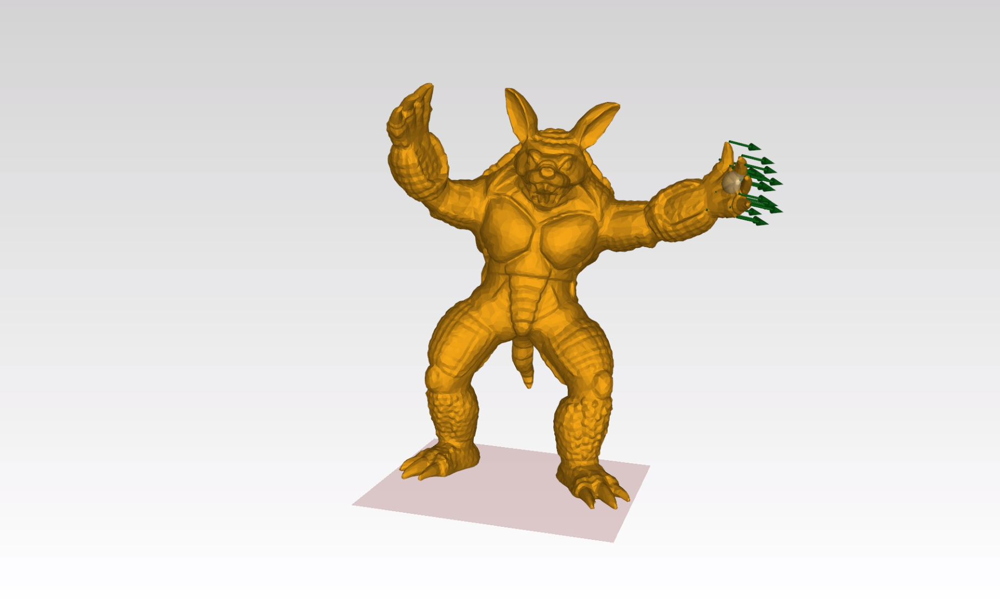
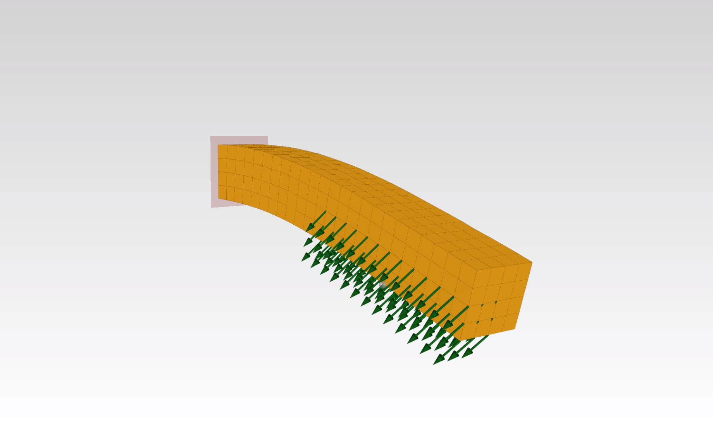
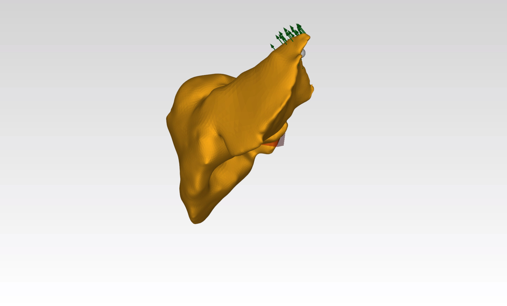

## DeepPhysX

### Interfacing AI with simulation

The **DeepPhysX** project provides Python packages allowing users to easily interface their **numerical simulations**
with **learning algorithms**.

**DeepPhysX** provides a **Core** package with no dependency on any **simulation** or **AI** framework.
Then other packages are compatible with this **Core** and a specific **simulation** or **AI** framework:
* [DeepPhysX_Sofa](https://github.com/mimesis-inria/DeepPhysX_Sofa) as simulation packages;
* [DeepPhysX_Torch](https://github.com/mimesis-inria/DeepPhysX_Torch) as AI packages.


### Features

**DeepPhysX** is a full Python3 projects with 3 main features:
* Generate a dataset with synthetic data from numerical simulations;
* Train an artificial neural network with a synthetic dataset;
* Use the predictions of a trained network in a numerical simulation.

The full list of features is detailed in the [**documentation**](https://deepphysx.readthedocs.io).


### Quick install

The project was initially developed using [SOFA](https://www.sofa-framework.org/) as the **simulation package** and
[PyTorch](https://pytorch.org/) as the **AI framework**. 
Thus, **DeepPhysX** is mainly designed for these frameworks, but obviously **other frameworks** can also be used.
The packages corresponding to these frameworks will therefore be used for the default installation.
For further instructions (dependencies, set up your installation config, developer mode), please refer to the 
[**documentation**](https://deepphysx.readthedocs.io).

``` bash
$ pip install DeepPhysX             # Install default package
$ pip install DeepPhysX_Sofa        # Install simulation package
$ pip install DeepPhysX_Torch       # Install AI package
```


### Demos

**DeepPhysX** includes a set of detailed tutorials, examples and demos.
Following this installation process to directly try the **interactive demos**:

``` bash
$ mkdir DeepPhysX
$ cd DeepPhysX
$ git clone https://github.com/mimesis/deepphysx.git Core   # Make shure to clone this repository in 'DeepPhysX/Core'
$ cd Core
$ python3 config.py                                         # Answer 'yes' to install Torch package to launch examples
$ pip install .
```

|        **Armadillo**<br>`python3 demo.py armadillo`        |        **Beam**<br>`python3 demo.py beam`        |        **Liver**<br>`python3 demo.py liver`        |
|:----------------------------------------------------------:|:------------------------------------------------:|:--------------------------------------------------:|
|  |  |  |
